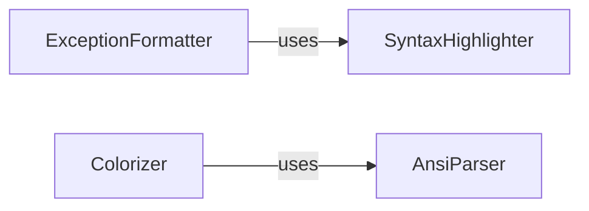

## Component Details

This component is dedicated to enhancing the visual presentation and debuggability of log messages within the `loguru` project. It achieves this by processing and rendering Python exception tracebacks in a more user-friendly and informative manner, including extracting detailed frame information, highlighting relevant code lines, and displaying variable values. Additionally, it manages the application and parsing of ANSI escape codes for colored terminal output, ensuring messages are visually distinct and readable.

### SyntaxHighlighter

This component is responsible for applying syntax highlighting to source code. It tokenizes Python code and formats different elements (keywords, strings, numbers, comments, etc.) with specific ANSI escape codes to enhance readability, particularly when displaying code snippets within exception tracebacks.

**Related Classes/Methods**:

- `SyntaxHighlighter` (0:0)

### ExceptionFormatter

This is the core component for generating human-readable and detailed exception tracebacks. It integrates syntax highlighting (via `SyntaxHighlighter`), extracts and displays relevant variable values at the point of error, and provides improved formatting for complex scenarios like chained exceptions and exception groups, significantly aiding in debugging.

**Related Classes/Methods**:

- `ExceptionFormatter` (0:0)

### AnsiParser

This component is dedicated to parsing and converting Loguru's custom `<tag>`-based color markup within text into standard ANSI escape codes. It provides methods to either apply these colors to tokens or strip them entirely, enabling flexible control over terminal output styling.

**Related Classes/Methods**:

- `AnsiParser` (0:0)

### Colorizer

This component acts as a high-level utility for applying and managing colors in log messages and format strings. It leverages the `AnsiParser` to process color tags, ensuring that log output is consistently and correctly styled for terminal display, thereby improving readability and visual organization.

**Related Classes/Methods**:

- `Colorizer` (0:0)

### [FAQ](https://github.com/CodeBoarding/GeneratedOnBoardings/tree/main?tab=readme-ov-file#faq)