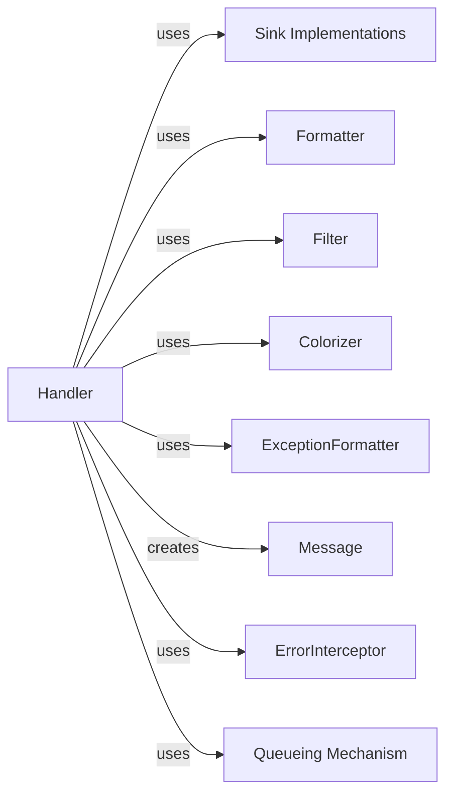

## Component Details

These components are fundamental to the `Handler & Dispatcher` subsystem because they collectively enable the core functionality of Loguru: -   **`Handler`**: This is the orchestrator. Without it, log records would have no central point for processing, filtering, formatting, and dispatching. It's the brain of this subsystem.

### Handler

The `Handler` class is the central processing unit within Loguru's logging pipeline. It receives raw log records, applies filtering based on severity and custom rules, formats the log message (including dynamic formatting and colorization), and manages an optional multiprocessing-safe queue for non-blocking I/O. Finally, it dispatches the fully processed log messages to their designated `Sink Implementations`. It also integrates with an `ExceptionFormatter` for enhanced traceback presentation and an `ErrorInterceptor` for robust error handling during the logging process.

**Related Classes/Methods**:

- `Handler` (1:1)

### Sink Implementations

These are the concrete destinations where processed log messages are written. `Sink Implementations` can represent various output targets such as files, the console, or network streams. The `Handler` interacts with these sinks to perform the actual output operation.

**Related Classes/Methods**:

- `Sink Implementations` (1:1)

- `Sink Implementations` (1:1)

### Formatter

The `Formatter` is responsible for transforming raw log record data into a structured and human-readable string. It defines the layout and content of the final log message, which can include timestamps, log levels, message content, and other contextual information. The `Handler` utilizes a `Formatter` to prepare the log entry before dispatch.

**Related Classes/Methods**: _None_

### Filter

The `Filter` component provides a mechanism to selectively process log records. It evaluates incoming records against defined criteria (e.g., log level, custom conditions) and determines whether a record should be allowed to proceed through the logging pipeline or be discarded. The `Handler` applies this filter before formatting and dispatching.

**Related Classes/Methods**:

- `Filter` (1:1)

### Colorizer

The `Colorizer` is dedicated to enhancing log output with ANSI escape codes, enabling colored text in terminal environments. It processes format strings and log messages to apply appropriate color and style, improving readability and visual distinction of log entries. The `Handler` leverages the `Colorizer` when colored output is enabled.

**Related Classes/Methods**:

- `Colorizer` (1:1)

### ExceptionFormatter

This component specializes in formatting Python exceptions and tracebacks. It enriches standard traceback information with features like syntax highlighting, variable inspection, and improved presentation for chained exceptions, making debugging more efficient. The `Handler` uses the `ExceptionFormatter` to process exception details within log records.

**Related Classes/Methods**:

- `ExceptionFormatter` (1:1)

### Message

`Message` is a simple string subclass used by the `Handler` to encapsulate the final formatted log string. It allows the `Handler` to attach the original log `record` object to the formatted message, providing a convenient way to access the raw log data even after formatting.

**Related Classes/Methods**:

- `Message` (1:1)

### ErrorInterceptor

The `ErrorInterceptor` is a robust mechanism for handling exceptions that occur internally within the logging process, particularly within `Handler` operations or `Sink Implementations`. It prevents these internal errors from crashing the application and can optionally print error details to a fallback destination.

**Related Classes/Methods**:

- `ErrorInterceptor` (1:1)

### Queueing Mechanism

This component provides an asynchronous and multiprocessing-safe queue for handling log messages. When enabled, the `Handler` places formatted log messages into this queue, allowing the actual writing to `Sink Implementations` to occur in a separate thread or process, thereby preventing blocking I/O operations from impacting the main application's performance.

**Related Classes/Methods**:

- `Queueing Mechanism` (1:1)

### [FAQ](https://github.com/CodeBoarding/GeneratedOnBoardings/tree/main?tab=readme-ov-file#faq)