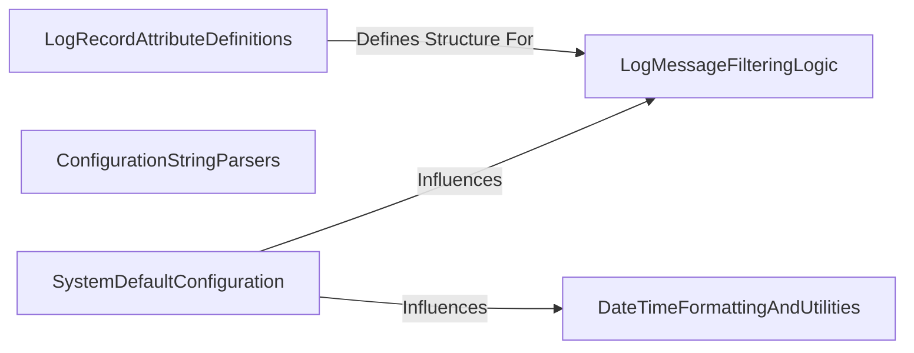

## Component Details

One paragraph explaining the functionality which is represented by this graph. What the main flow is and what is its purpose.

### LogRecordAttributeDefinitions

This component defines the foundational data structures (classes like `RecordLevel`, `RecordFile`, `RecordThread`, `RecordProcess`, and `RecordException`) that encapsulate various attributes of a log message. These structures are crucial for building the comprehensive dictionary (`record`) that accompanies each log entry, providing a standardized way to store contextual information such as log level, file origin, process/thread details, and exception information. The `RecordException` class specifically handles the serialization and deserialization of exception details, ensuring robust error logging.

**Related Classes/Methods**:

- <a href="https://github.com/Delgan/loguru/blob/master/loguru/_recattrs.py#L4-L16" target="_blank" rel="noopener noreferrer">`loguru._recattrs.RecordLevel` (4:16)</a>

- <a href="https://github.com/Delgan/loguru/blob/master/loguru/_recattrs.py#L19-L30" target="_blank" rel="noopener noreferrer">`loguru._recattrs.RecordFile` (19:30)</a>

- <a href="https://github.com/Delgan/loguru/blob/master/loguru/_recattrs.py#L33-L44" target="_blank" rel="noopener noreferrer">`loguru._recattrs.RecordThread` (33:44)</a>

- <a href="https://github.com/Delgan/loguru/blob/master/loguru/_recattrs.py#L47-L58" target="_blank" rel="noopener noreferrer">`loguru._recattrs.RecordProcess` (47:58)</a>

- <a href="https://github.com/Delgan/loguru/blob/master/loguru/_recattrs.py#L61-L91" target="_blank" rel="noopener noreferrer">`loguru._recattrs.RecordException` (61:91)</a>

### DateTimeFormattingAndUtilities

This component provides a comprehensive suite of utilities for handling and formatting `datetime` objects. Its functionalities include parsing various datetime format strings, managing timezone information (especially converting to UTC), and generating timezone-aware current timestamps. It ensures that all time-related information included in log records is accurate, consistently formatted, and easily manipulable for display or analysis.

**Related Classes/Methods**:

- <a href="https://github.com/Delgan/loguru/blob/master/loguru/_datetime.py#L1-L2" target="_blank" rel="noopener noreferrer">`loguru._datetime` (1:2)</a>

### ConfigurationStringParsers

This component offers a collection of helper functions designed to parse human-readable string inputs into structured data types. Specifically, it handles parsing strings for durations (e.g., "1 week"), file sizes (e.g., "10 MB"), and rotation frequencies (e.g., "daily"). These parsing capabilities are essential for enabling flexible and intuitive configuration of log file management policies, such as rotation and retention.

**Related Classes/Methods**:

- <a href="https://github.com/Delgan/loguru/blob/master/loguru/_string_parsers.py#L1-L2" target="_blank" rel="noopener noreferrer">`loguru._string_parsers` (1:2)</a>

### LogMessageFilteringLogic

This component implements various strategies for filtering log messages based on predefined or custom criteria. It determines whether a given log message should be processed and emitted or discarded, offering fine-grained control over log verbosity and relevance. Filtering can be based on factors such as log level, module name, or the presence of a specific logger name.

**Related Classes/Methods**:

- <a href="https://github.com/Delgan/loguru/blob/master/loguru/_filters.py#L1-L2" target="_blank" rel="noopener noreferrer">`loguru._filters` (1:2)</a>

### SystemDefaultConfiguration

This component establishes and provides the default configuration settings for the entire logging system. It includes an `env` helper function to read environment variables, allowing these defaults to be overridden externally. This ensures a consistent and predictable baseline for logging behavior when no explicit configuration is provided by the user, covering aspects like default log levels, message formats, and other operational parameters.

**Related Classes/Methods**:

- <a href="https://github.com/Delgan/loguru/blob/master/loguru/_defaults.py#L3-L26" target="_blank" rel="noopener noreferrer">`loguru._defaults.env` (3:26)</a>

### [FAQ](https://github.com/CodeBoarding/GeneratedOnBoardings/tree/main?tab=readme-ov-file#faq)