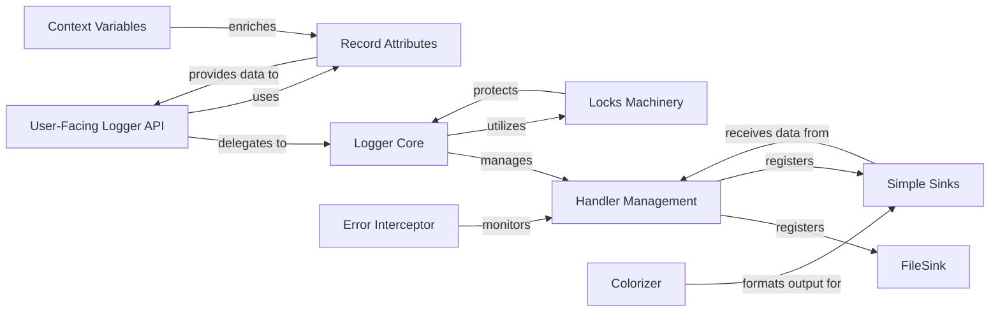

## Component Details

The `Logger Core` (represented by the `loguru._logger.Core` class) is the foundational internal component that manages the entire logging system's state and operations. It's responsible for: Level Management, Handler Management, Global Configuration, Thread Safety, and Internal State.

### Logger Core

The central internal class (`loguru._logger.Core`) that orchestrates logging levels, handler management, global configuration, and thread safety. It's the backbone of the Loguru system, managing the internal state and logic for all logging operations.

**Related Classes/Methods**:

- <a href="https://github.com/Delgan/loguru/blob/master/loguru/_logger.py#L1-L1" target="_blank" rel="noopener noreferrer">`loguru._logger.Core` (1:1)</a>

### User-Facing Logger API

This is the public `logger` object (an instance of `loguru._logger.Logger`) that users interact with directly to emit log messages (e.g., `logger.info()`, `logger.debug()`) and configure global logging behavior (e.g., `logger.add()`, `logger.remove()`). It acts as a facade, delegating core operations to the `Logger Core` instance.

**Related Classes/Methods**:

- <a href="https://github.com/Delgan/loguru/blob/master/loguru/_logger.py#L1-L1" target="_blank" rel="noopener noreferrer">`loguru._logger.Logger` (1:1)</a>

### Handler Management

This component (primarily within `loguru._handler.py` and managed by `Logger Core`) is responsible for the lifecycle and dispatching of log sinks (handlers). It manages adding, removing, and processing log messages through registered sinks.

**Related Classes/Methods**:

- <a href="https://github.com/Delgan/loguru/blob/master/loguru/_handler.py#L1-L1" target="_blank" rel="noopener noreferrer">`loguru._handler` (1:1)</a>

### FileSink

A specialized log sink (`loguru._file_sink.FileSink`) responsible for writing log messages to files, including advanced features like file rotation, retention, and compression. It's a concrete implementation of a handler managed by the `Logger Core` through `Handler Management`.

**Related Classes/Methods**:

- <a href="https://github.com/Delgan/loguru/blob/master/loguru/_file_sink.py#L163-L441" target="_blank" rel="noopener noreferrer">`loguru._file_sink.FileSink` (163:441)</a>

### Locks Machinery

Provides the necessary synchronization primitives (locks) to ensure thread safety across the logging system, especially when multiple threads attempt to write logs or modify logging configurations concurrently.

**Related Classes/Methods**:

- <a href="https://github.com/Delgan/loguru/blob/master/loguru/_locks_machinery.py#L1-L1" target="_blank" rel="noopener noreferrer">`loguru._locks_machinery` (1:1)</a>

### Record Attributes

This component is responsible for collecting and managing various attributes associated with a log message, such as the timestamp, level, message content, file path, line number, and extra context. These attributes form the "record" that is passed to sinks for formatting and output.

**Related Classes/Methods**:

- <a href="https://github.com/Delgan/loguru/blob/master/loguru/_recattrs.py#L1-L1" target="_blank" rel="noopener noreferrer">`loguru._recattrs` (1:1)</a>

### Colorizer

Handles the application of ANSI escape codes for coloring log messages, enabling visually distinct output in terminals. It's typically used by sinks that output to consoles.

**Related Classes/Methods**:

- <a href="https://github.com/Delgan/loguru/blob/master/loguru/_colorizer.py#L1-L1" target="_blank" rel="noopener noreferrer">`loguru._colorizer` (1:1)</a>

### Context Variables

Provides mechanisms for managing context-specific data that can be implicitly added to log records, allowing for contextual logging without explicitly passing data through function calls.

**Related Classes/Methods**:

- <a href="https://github.com/Delgan/loguru/blob/master/loguru/_contextvars.py#L1-L1" target="_blank" rel="noopener noreferrer">`loguru._contextvars` (1:1)</a>

### Error Interceptor

A mechanism to intercept and handle errors that occur within the logging process itself, preventing logging failures from crashing the application and potentially logging these internal errors.

**Related Classes/Methods**:

- <a href="https://github.com/Delgan/loguru/blob/master/loguru/_error_interceptor.py#L1-L1" target="_blank" rel="noopener noreferrer">`loguru._error_interceptor` (1:1)</a>

### Simple Sinks

Provides basic implementations of log sinks, such as writing to standard output (stdout) or standard error (stderr), without the advanced features of `FileSink`. These are often the default sinks.

**Related Classes/Methods**:

- <a href="https://github.com/Delgan/loguru/blob/master/loguru/_simple_sinks.py#L1-L1" target="_blank" rel="noopener noreferrer">`loguru._simple_sinks` (1:1)</a>

### [FAQ](https://github.com/CodeBoarding/GeneratedOnBoardings/tree/main?tab=readme-ov-file#faq)