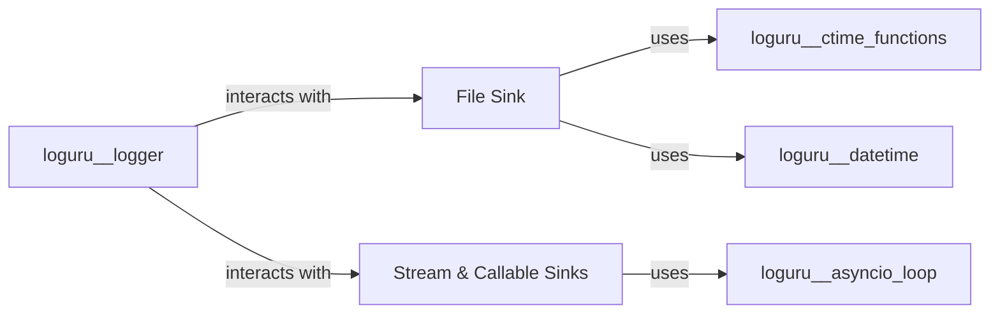

## Component Details

This component, `Sink Implementations`, serves as the collection of concrete destinations for Loguru's log output. It is fundamental to Loguru's operation as it defines *where* and *how* log messages are ultimately written. Without these implementations, the logger would have no output mechanism.

### File Sink

This component is responsible for writing log messages to files, offering advanced features such as automatic file rotation based on size or time, retention policies to manage the number or age of archived logs, and compression of old log files. It ensures robust and manageable log file handling.

**Related Classes/Methods**:

- `FileSink` (0:0)

- `Rotation` (0:0)

- `Retention` (0:0)

- `Compression` (0:0)

- `FileDateFormatter` (0:0)

### Stream & Callable Sinks

This component provides flexible and straightforward log output destinations. It includes `StreamSink` for writing to standard I/O streams (like `sys.stdout` or `sys.stderr`), `CallableSink` for directing log messages to any custom Python function, `StandardSink` for adapting Loguru records to be compatible with Python's built-in `logging` module handlers, and `AsyncSink` for handling asynchronous callable functions.

**Related Classes/Methods**:

- `StreamSink` (0:0)

- `CallableSink` (0:0)

- `StandardSink` (0:0)

- `AsyncSink` (0:0)

### [FAQ](https://github.com/CodeBoarding/GeneratedOnBoardings/tree/main?tab=readme-ov-file#faq)