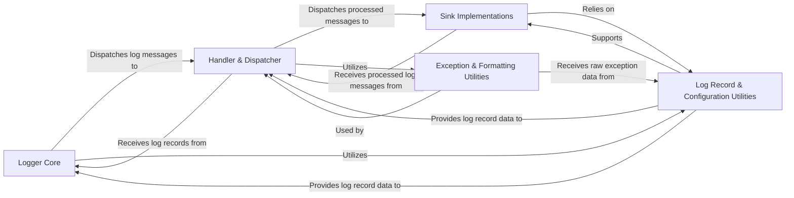

## Component Details

The architecture of `loguru` is designed around a clear separation of concerns, enabling robust and flexible logging. Based on the Control Flow Graph (CFG) and Source Analysis, the system can be distilled into five fundamental components: Logger Core, Handler & Dispatcher, Sink Implementations, Exception & Formatting Utilities, and Log Record & Configuration Utilities. These components represent the core responsibilities and interaction points within the `loguru` library, handling everything from message creation and processing to output and advanced formatting, forming a cohesive and efficient logging architecture.

### Logger Core

This is the primary user-facing API and the central orchestrator of the Loguru logging system. It provides the public interface for users to emit log messages (e.g., `logger.info()`, `logger.debug()`), configure global logging behavior (adding/removing sinks, setting levels), and initiates the log processing pipeline for every message. It's the entry point for all logging operations.

**Related Classes/Methods**:

- <a href="https://github.com/Delgan/loguru/blob/master/loguru/_logger.py#L1-L10000" target="_blank" rel="noopener noreferrer">`loguru._logger` (1:10000)</a>

### Handler & Dispatcher

This component acts as an intermediary, receiving raw log records from the `Logger Core`. Its primary responsibilities include applying filtering based on severity level and custom rules, formatting the log message according to the handler's specific configuration, managing an optional multiprocessing-safe queue for non-blocking I/O operations, and then dispatching the final processed message to its designated `Sink Implementations`.

**Related Classes/Methods**:

- <a href="https://github.com/Delgan/loguru/blob/master/loguru/_handler.py#L1-L10000" target="_blank" rel="noopener noreferrer">`loguru._handler` (1:10000)</a>

### Sink Implementations

This component represents a collection of concrete destinations for log output. It includes specialized `File Sink` implementations that provide robust file management features (automatic file rotation by size or time, retention policies, compression of archived log files), as well as `Stream & Callable Sinks` for writing to standard I/O streams, executing arbitrary Python callable functions for custom handling, or adapting Loguru records to be compatible with Python's built-in `logging` module handlers.

**Related Classes/Methods**:

- <a href="https://github.com/Delgan/loguru/blob/master/loguru/_file_sink.py#L1-L10000" target="_blank" rel="noopener noreferrer">`loguru._file_sink` (1:10000)</a>

- <a href="https://github.com/Delgan/loguru/blob/master/loguru/_simple_sinks.py#L1-L10000" target="_blank" rel="noopener noreferrer">`loguru._simple_sinks` (1:10000)</a>

### Exception & Formatting Utilities

This component is dedicated to enhancing the visual presentation and debuggability of log messages. It processes and renders Python exception tracebacks in a more user-friendly and informative manner, including extracting detailed frame information, highlighting relevant code lines, and displaying variable values. Additionally, it manages the application and parsing of ANSI escape codes for colored terminal output, ensuring messages are visually distinct and readable.

**Related Classes/Methods**:

- <a href="https://github.com/Delgan/loguru/blob/master/loguru/_better_exceptions.py#L1-L10000" target="_blank" rel="noopener noreferrer">`loguru._better_exceptions` (1:10000)</a>

- <a href="https://github.com/Delgan/loguru/blob/master/loguru/_colorizer.py#L1-L10000" target="_blank" rel="noopener noreferrer">`loguru._colorizer` (1:10000)</a>

### Log Record & Configuration Utilities

This component provides the foundational data structures and helper functions that support the core logging process and configuration. It is responsible for dynamically constructing the comprehensive dictionary (`record`) that accompanies each log message (gathering contextual data like time, file info, process/thread IDs, and exception details). It also offers various utility functions for parsing human-readable strings for durations, sizes, and frequencies (used in file rotation/retention), formatting datetime objects, and implementing diverse filtering strategies for log messages.

**Related Classes/Methods**:

- <a href="https://github.com/Delgan/loguru/blob/master/loguru/_recattrs.py#L1-L10000" target="_blank" rel="noopener noreferrer">`loguru._recattrs` (1:10000)</a>

- <a href="https://github.com/Delgan/loguru/blob/master/loguru/_datetime.py#L1-L10000" target="_blank" rel="noopener noreferrer">`loguru._datetime` (1:10000)</a>

- <a href="https://github.com/Delgan/loguru/blob/master/loguru/_string_parsers.py#L1-L10000" target="_blank" rel="noopener noreferrer">`loguru._string_parsers` (1:10000)</a>

- <a href="https://github.com/Delgan/loguru/blob/master/loguru/_filters.py#L1-L10000" target="_blank" rel="noopener noreferrer">`loguru._filters` (1:10000)</a>

- <a href="https://github.com/Delgan/loguru/blob/master/loguru/_defaults.py#L1-L10000" target="_blank" rel="noopener noreferrer">`loguru._defaults` (1:10000)</a>

### [FAQ](https://github.com/CodeBoarding/GeneratedOnBoardings/tree/main?tab=readme-ov-file#faq)